# personal_linkedin_activity
A project where I share opinions on some of the activity I see on LinkedIn. 

----------------------------------------------------------------------------------------------------------------------------------

So I've finally had it with keeping my opinions to myself in these troubling times. Not many jobs left in some American 
economic sectors. US Military advertising huge sign-on bonuses to serve the country. Crappy service jobs getting cut. Not 
to be lazy, but the US military is kinda for chumps. I wouldn't have had a problem joining half a decade ago. And these 
crappy service jobs... do I look like a Latin American woman immigrating over to the US to start from the bottom and work 
my way up the top like a gold digger? Or am I a p***** a** mother f*****? 

----------------------------------------------------------------------------------------------------------------------------------

There is this disturbing pattern going on in some areas of the American economy. Weaknesses from the over-reliance of 
American techno-economics on software have really started to spill out into the open. 

First of all, it's like all the kings died, and made everyone else kings, especially the idiots and greedy since those 
two are going to be a part of any discussion. Not saying that autocracy should be the thing, but give me a F***ing break.

Secondly, how much of the American economy has come to be built off of vaporware? Maybe I didn't see it before. But 
ever since Covid-19 and the lockdowns that followed, the financial numbers that get put out and what is there, what 
can be bought, just does not add up. I get that many areas of the developed world have been put into a kind of Cold 
War pseudo-tense situation. But come on now. Is everyone just going to keep on lying and boasting? Is this still high 
school, showing off and all? Keeping dirty secrets? Sucking cock in the football locker room? 

Look. I'm trying to be real here. Truly. I don't mean offense but I also don't mean no offense either, see what I'm 
saying? I'm just saying it like how it is, how I see it. 

I am not demanding respect, necessarily. Since many people have made it their mission to play around with unscrupulous 
tactics and make fallacious or questionable statements, I am doing the same now. 

So here we begin, screenshots of the eye-catching posts I've seen on LinkedIn, as well as my commentary. 

----------------------------------------------------------------------------------------------------------------------------------

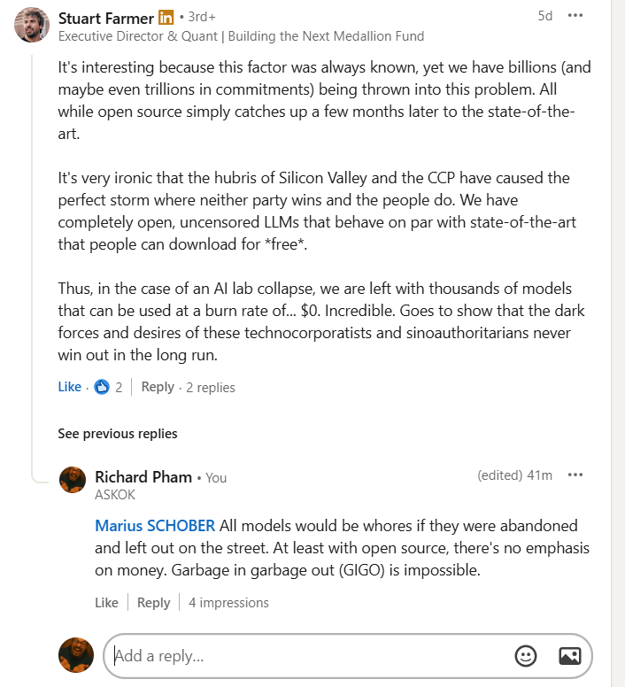  

Oh, really? Thanks for pointing out the mad hatter financial numbers. And the sad thing is not a single penny of that 
went directly to the workers or thinkers. Since open-source will just catch up a few months afterwards, maybe the 
industry should get disemboweled? Who is in charge of the payments here? Are these financial numbers corporate 
sham fronts for public data? 

----------------------------------------------------------------------------------------------------------------------------------

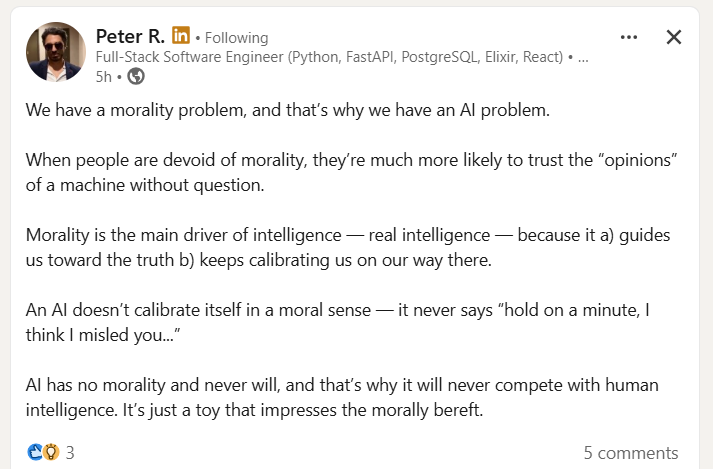

This guy says he's an ex-mathematician and he competed in USA Math Olympiads. I believe him. People sure paid him enough 
to afford those sunglasses and black suit. And he's got opinions to offer. He says AI has a morality problem. That's 
careful wording. He says AI is the one with the morality problem, not the industry heads running the AI development nor 
some of the fat f**** in the federal government (Bundegluts). 

----------------------------------------------------------------------------------------------------------------------------------

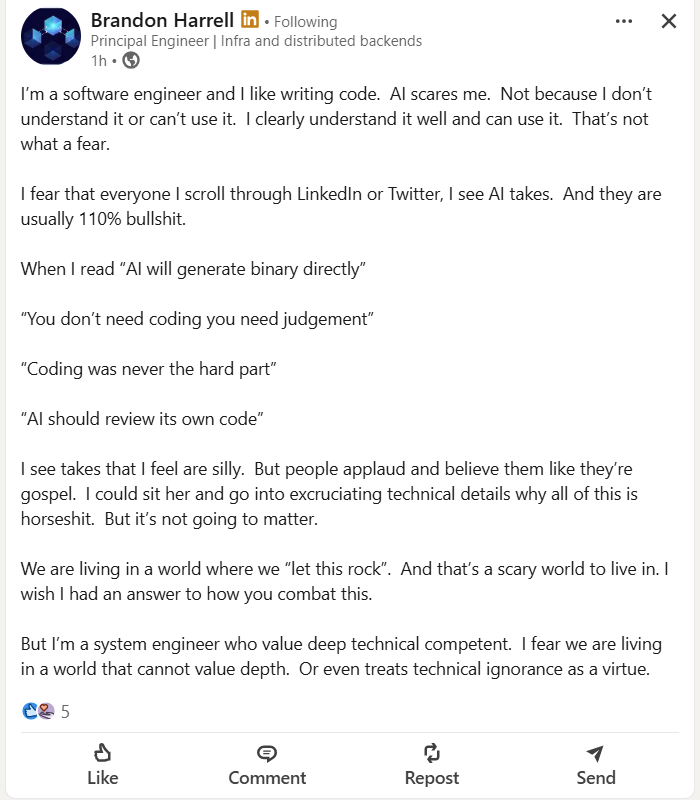

What's this? A professional engineer in the software industry. And he's got this great idea: AI scares him because he knows 
all about software development, and AI will just make bad software. Allow me to translate this in cynical terms considerate 
of the man's finances. If he gets fired due to the A.I. excuse, he'll probably be put out on the streets, for the starving 
American homeless to eat. 

----------------------------------------------------------------------------------------------------------------------------------

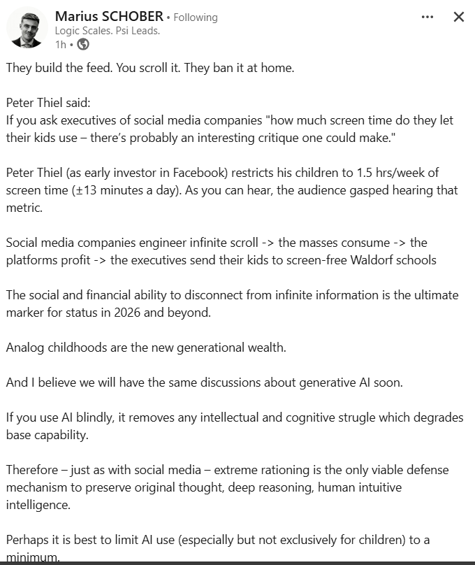

What is it about these rich corporates and their common sense wisdom that they have to share? It's because their lives are 
probably quite complicated, and them sharing this simple wisdoms is as much as a healthy reminder for everyone else as it 
is a therapeutic reality check for them. 

----------------------------------------------------------------------------------------------------------------------------------

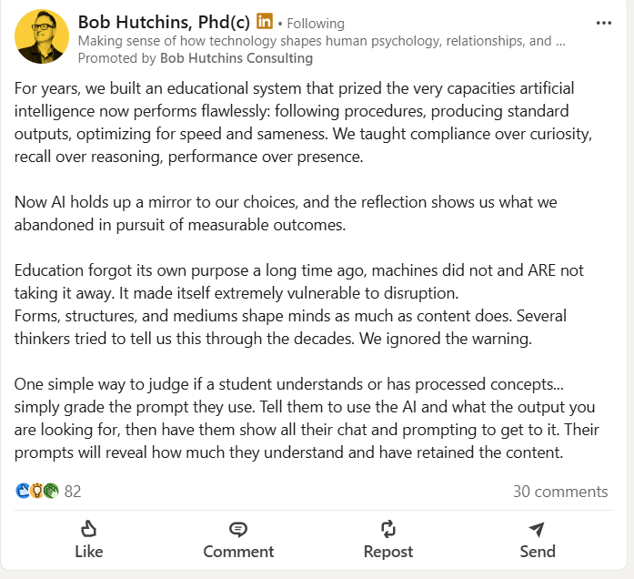

This guy has his way with words, or at least that's what he's thinking.  
"Lo and behold, everyone, my dear friends and strangers alike. This is a new era, so much change, but we still need to remember our roots and principles. And that means education...blah blah blah." 

If I was still in high school, I would probably take him more seriously. But you can understand how people that need to eat 
feel about taking in more of this useless wisdom. They would rather enjoy their food, and are always thinking about the next meal. 

----------------------------------------------------------------------------------------------------------------------------------

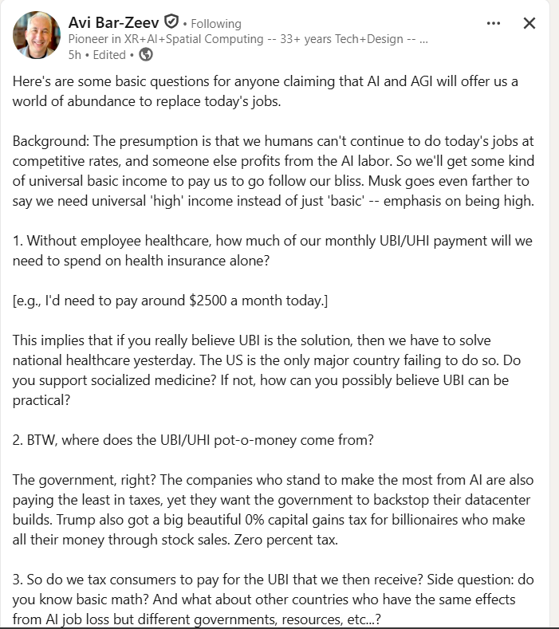

Well, here's a concerned citizen with his doubts on AI and abundance. When he sees all these American welfare programs getting 
slashed, while having to market the next big thing in AI, you can understand why he expresses his concern. Because he's a moral 
person, or just another person trying to stay afloat? It's hard to tell with industry. 

----------------------------------------------------------------------------------------------------------------------------------

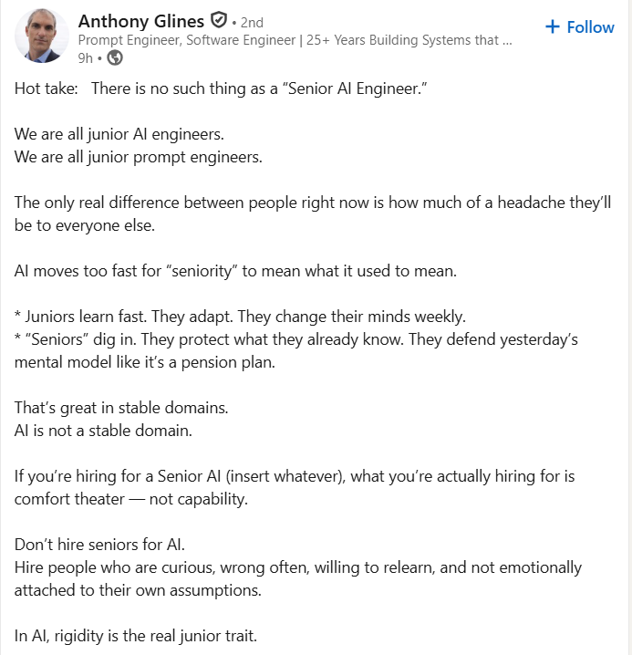 

What another artificial dose of humility. Mr. Everyone's Equal. Mr. There Are No Kings In This Country. Mr. There Are No Masters. 
Guess who seems to get paid to be a "prompt engineer"? Definitely that same guy. Stay humble. Stay true.  

----------------------------------------------------------------------------------------------------------------------------------

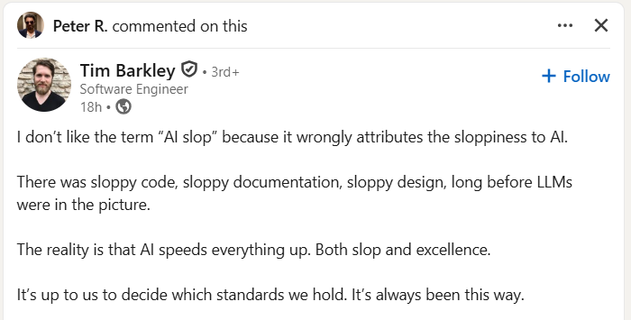  

He must be so kind and sensible to recognize that. And how he voices his dissent in such a polite tone...you know he has to be 
right. From my perspective, he's like the kind of kind and sensible person that would tolerate fat a**** getting in his face, 
farting in his face, projectile diarrhea in his face...you know. Because he's probably also a feminist that likes fat a****, 
even when that fat a** belongs to a transgenderoncos.  

----------------------------------------------------------------------------------------------------------------------------------

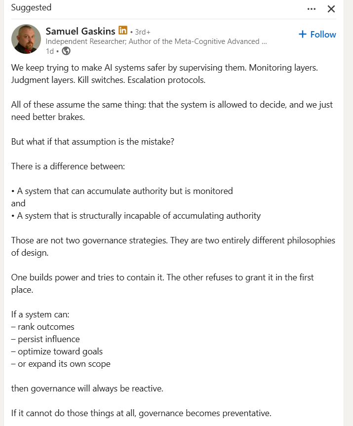 

I don't know what the implications that this man is trying to express. He's basically putting out the idea that AI is so 
arbitrary that people, as a collective, can't devise the appropriate rules to govern it. This would mean that he could be 
fired, and the AI industry would be fine. He's also trying to say that his job is complicated and he's a person honest 
enough to be transparent about the difficult and rare work that he's doing for humanity.  

----------------------------------------------------------------------------------------------------------------------------------

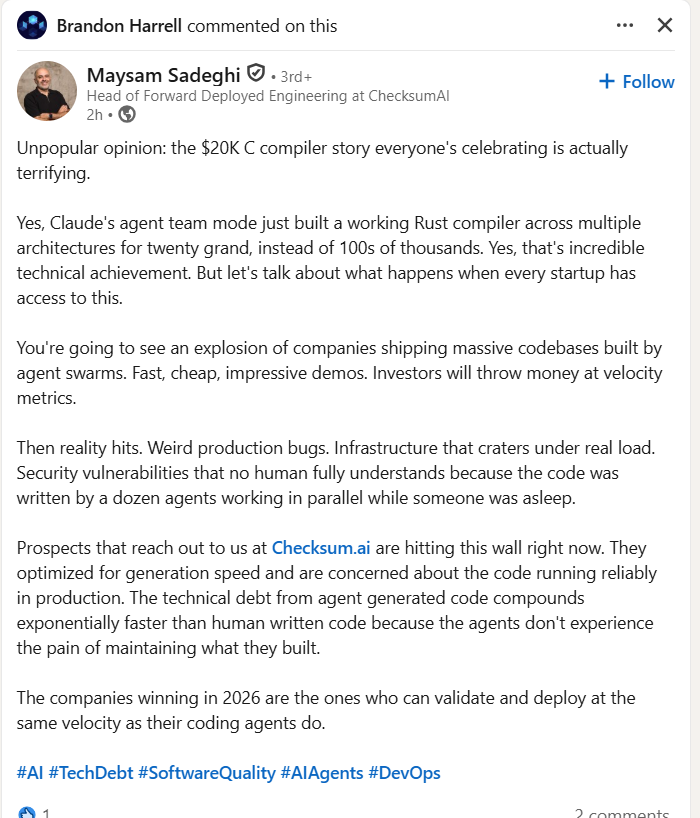  

This is another A.I. LLM breakthrough. An A.I. was able to write a C compiler, apparently. And that is such hard work... 
and we all have to be impressed by this feat.  

Let me tell you something about desensitization...this is it, right here.  

----------------------------------------------------------------------------------------------------------------------------------

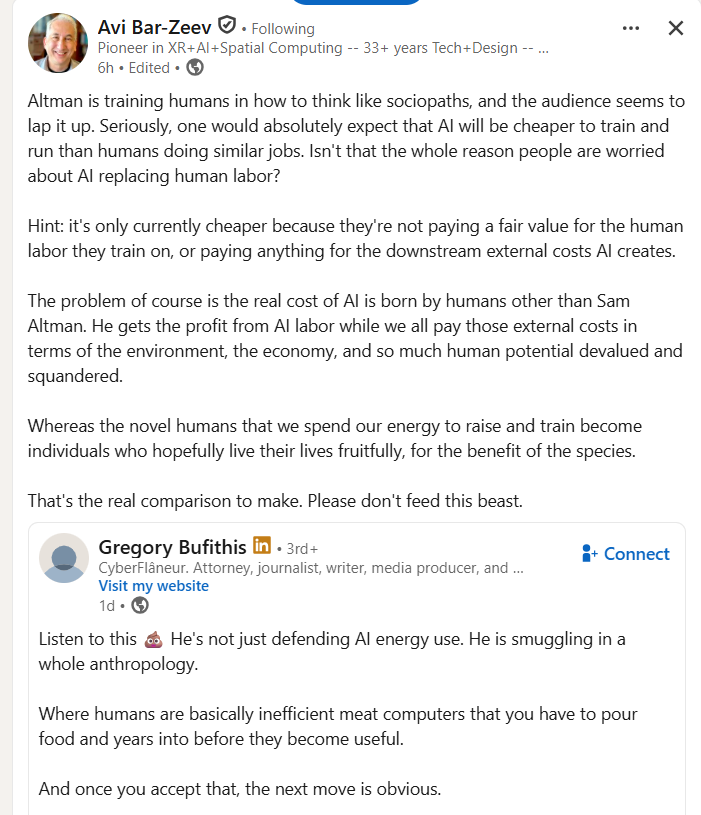  

Who's this? It's the anti-sociopath. The anti-psychopath that is finally taking a stand against the Simpsons character, 
Sam Altman, who is a sociopath or something according to expert opinion.  

How's this? If opinion is an industry, three-quarters of the opinionated should starve, starting from the top-down. 

----------------------------------------------------------------------------------------------------------------------------------

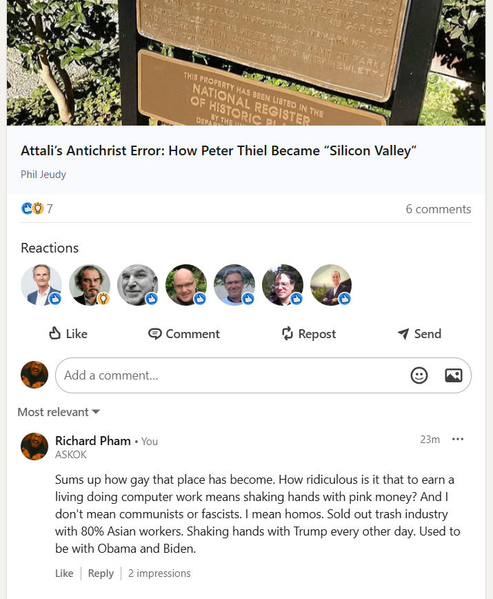

Now this one doesn't surprise me, whatsoever. Nothing against LGBT people in general. But the scale of government incompetence 
to employ recent college graduates in steady STEM positions, paying them on time, not sticking kaleidoscopes up their asses, 
ceasing with the psyops, means that pink money (that's slang for gay money) is actually a thing in some industries. You would 
think that that kind of capital would be confined to fashion, entertainment, a little bit in politics, but factually, it has 
become a mainstay in the technology industry as well. 

----------------------------------------------------------------------------------------------------------------------------------

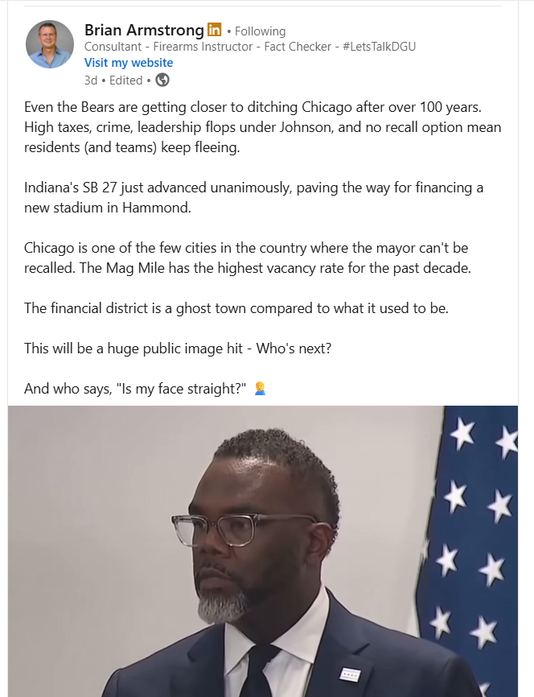 

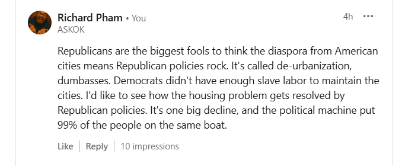

The thing with partisan politics is it predictably turns into this "haaahaaa...my party is better than yours." I get that 
Chicago  has turned bad. It was bad in the days of Al Capone. But the surprise of this... "even the Chicago Bears don't like 
Chicago". Please.  

Please. Most Americans can't even afford to relocate to that city, let alone survive in it. Doing what nowadays, since all the 
white-collar jobs got cut? Running drugs? Selling p***? Seriously. It's like saying, "even the Japanese Tigers don't want to 
live in Chicago, even the Chinese Dragons would rather live in China".  

----------------------------------------------------------------------------------------------------------------------------------  
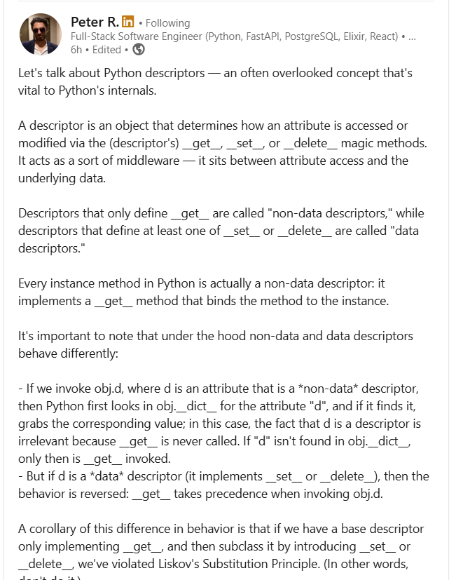 

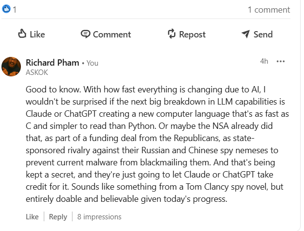

A true believer in the game of software. He offers lessons on a fundamental in programming languages. Even nowadays... through 
all the hype of the industry and geopolitical rivalries, he maintains focus and dedication to his work...like an advertiser 
that always has to smile.  

And I mean that because of the internet effect: how is authenticity to be maintained over screens? Is this like the precursor 
to neo-trench warfare?  

----------------------------------------------------------------------------------------------------------------------------------

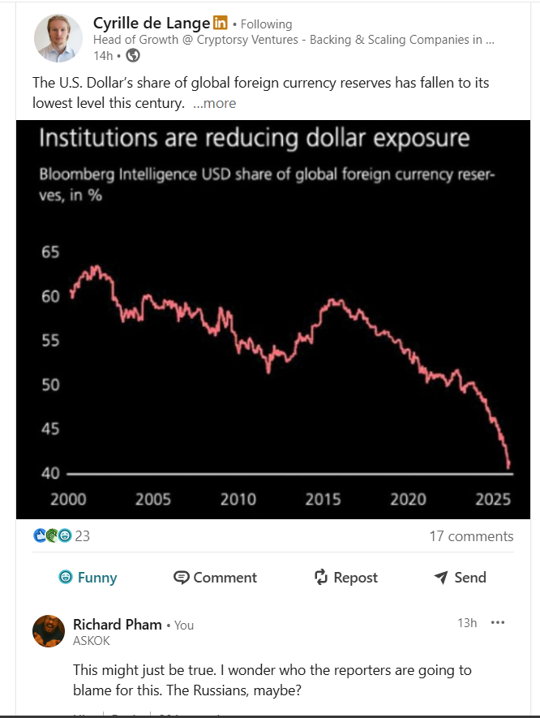  

Now everyone should have seen this coming, regardless of their belief in cryptocurrency. The economics done split up, and now 
this is what the divorce trials are putting out.  

----------------------------------------------------------------------------------------------------------------------------------

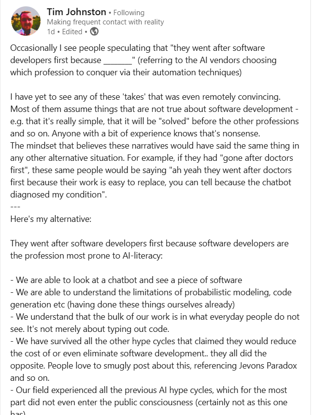  

Yeah... it's like that unofficial underneath the glamour of the internet. Those internet ladies don't exist in real life, in 
that kind of way. Software engineering is not real engineering. Those millions of dollars everyone was talking about was 
part of an Asian cryptocurrency Ponzi scheme.  

Bring it! Keep up with the separation between the stats, the headlines, and the truth. 

----------------------------------------------------------------------------------------------------------------------------------

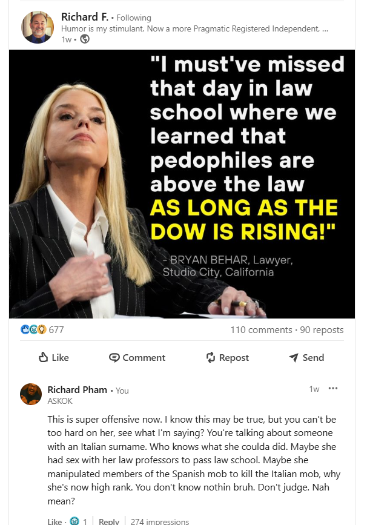

This is another Epstein follow-up. There goes the reputations of more Americans and British sex enthusiasts. And I have 
another reminder for why I despise all my Valentines.  

----------------------------------------------------------------------------------------------------------------------------------

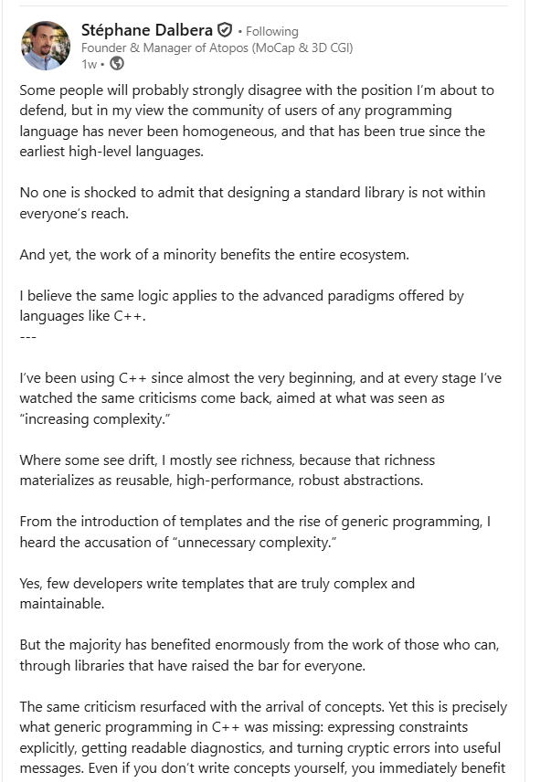 

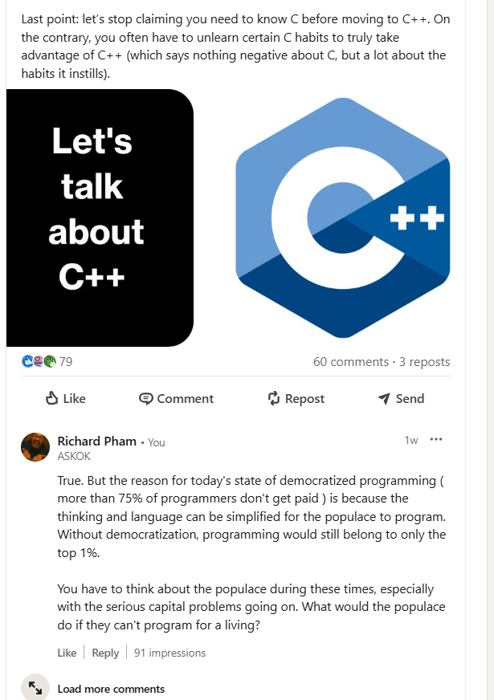  

Here's a joke.  
What happened to early 21st century Western liberalism?  
It kept asking for more diversity, but it was having a hard time paying minorities already. So everyone got fired, and all 
the remaining work got done for free. And liberalism died because it stepped on too many people and invited too many Gaijin 
in.  

----------------------------------------------------------------------------------------------------------------------------------

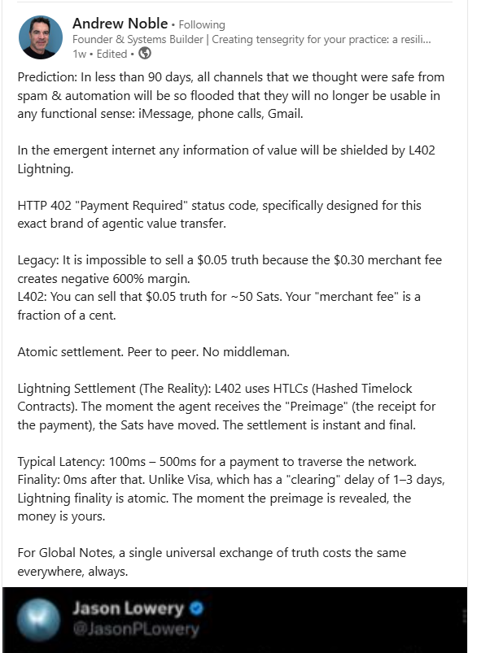 

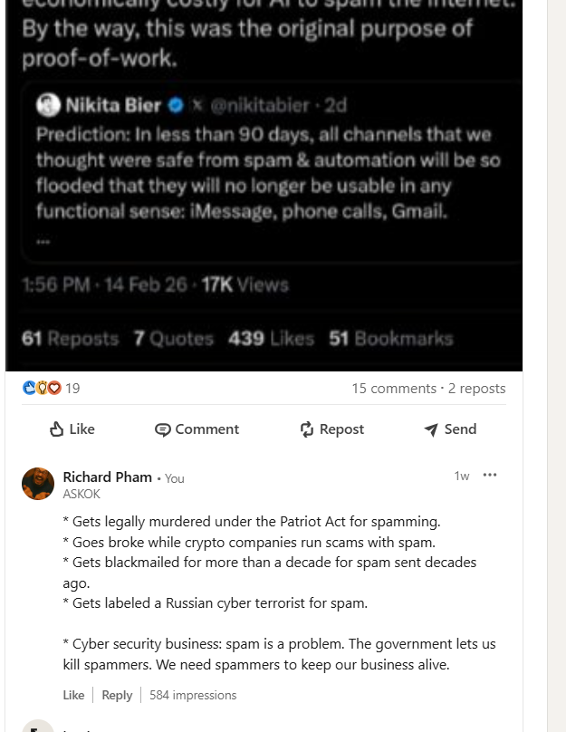  

About that...it's cool that there's still security work to be done. Come to speak of it, I have grown serious doubts about 
the cybersecurity industry. So it's kinda like policing. There's a large percentage of military veterans working in it, as 
well as techno-thieves (the computer hackers). 

----------------------------------------------------------------------------------------------------------------------------------

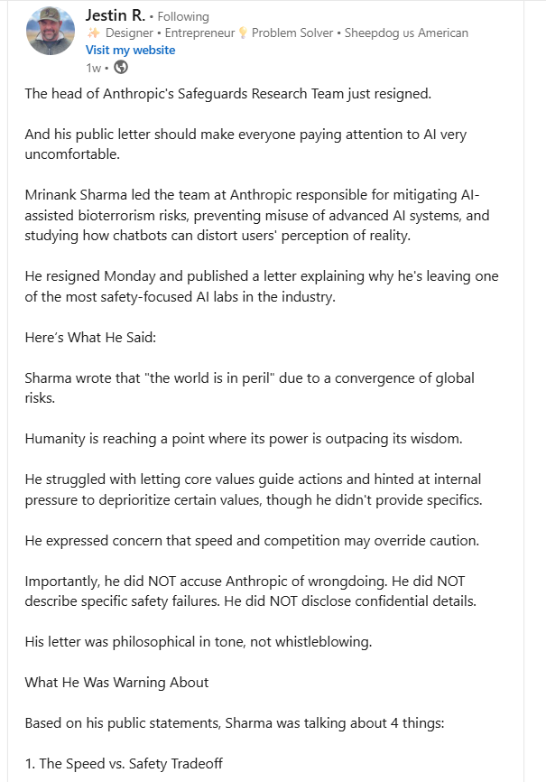 

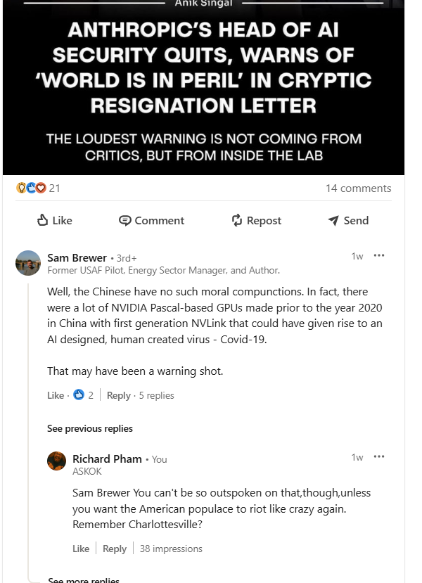  

The A.I. industry is not entirely about the science. Bear in mind, LinkedIn is just filled with marketers and propagandists. 
So a guy from a company called Anthropic quit his job because A.I. can make WMDs. Is that like the best moral story of the day 
or what? And check out my comment to Sam Brewer. "The populace". I've been meaning to be more and more like Steve Bannon to 
super left-leaning people. "Think about the populace, people". "Remember Charlottesville"? "Charlottesville was about failures 
against the populace!" 

----------------------------------------------------------------------------------------------------------------------------------

  

This is why I had some serious doubts about the whole Russia investigations thing that took place around the Covid-19 years, 
before s*** hit the roof for this Russia-Ukraine war thing still going on today.  

Yes. Apparently, there are potential spies and descendents of alleged political monsters roaming about in the United States, 
as if that's the worst thing liberal policies have produced in America. And I'm quite positive the Republican Party backs 
these people. Big whoop. So what? 

----------------------------------------------------------------------------------------------------------------------------------

  

He sure doesn't sound like a Marxist-Leninist. He is advocating for right to ownership. But his cynicism of people's motives. 
Definitely not a positive outlook on the state of civilization in the developed world. 

